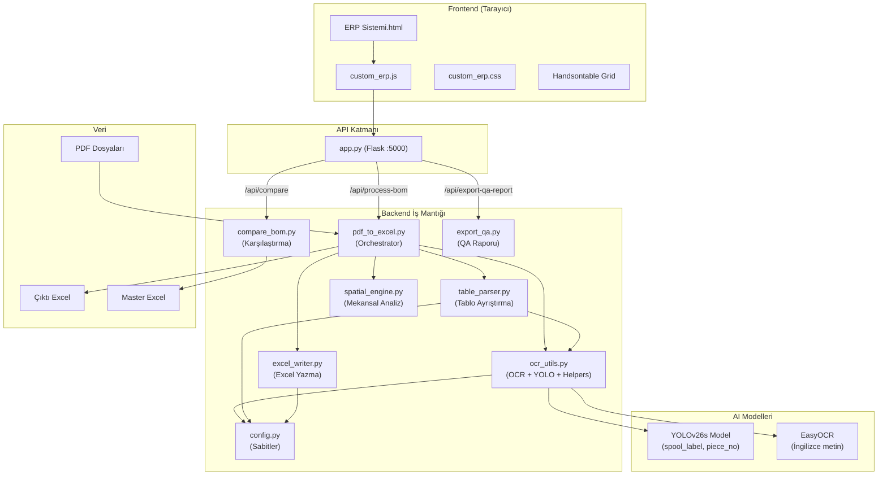
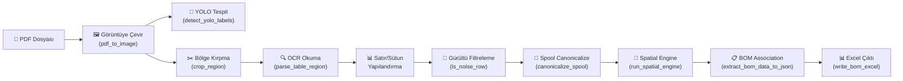
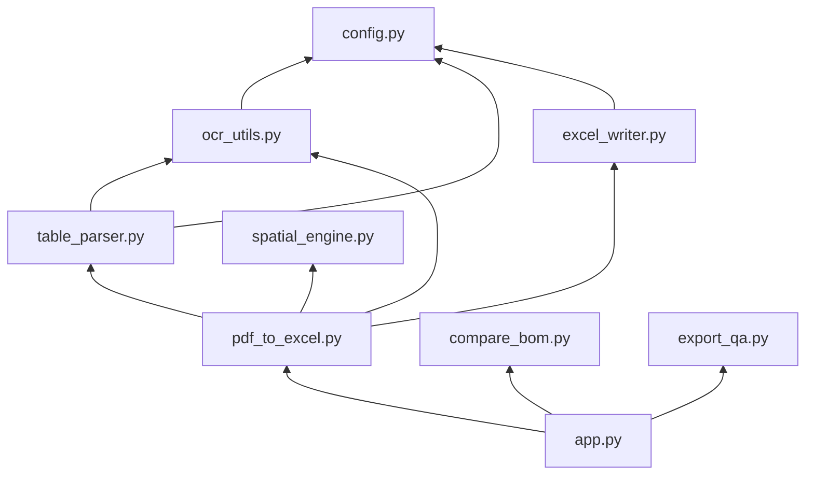

# 🏗️ Havatek ERP - PDF BOM Otomasyon Sistemi: Mimari Rehber

> **Son Güncelleme:** 29 Eylül 2026  
> **Versiyon:** v3.0 (Modüler Mimari)  
> **Durum:** ✅ Tüm modüller test edildi, sistem stabil çalışıyor

---

## 📋 İçindekiler

1. [Sistem Özeti](#-sistem-özeti)
2. [Proje Klasör Yapısı](#-proje-klasör-yapısı)
3. [Mimari Diyagram](#-mimari-diyagram)
4. [Veri Akış Pipeline'ı](#-veri-akış-pipelineı)
5. [Backend Modülleri (Detaylı)](#-backend-modülleri-detaylı)
6. [Frontend](#-frontend)
7. [API Endpoint'leri](#-api-endpointleri)
8. [Modül Bağımlılık Haritası](#-modül-bağımlılık-haritası)
9. [Fonksiyon Referansı](#-fonksiyon-referansı)
10. [Yapılandırma ve Kalibrasyon](#-yapılandırma-ve-kalibrasyon)
11. [Kurulum ve Çalıştırma](#-kurulum-ve-çalıştırma)

---

## 🎯 Sistem Özeti

Bu sistem, endüstriyel boru hattı (piping) teknik çizim PDF'lerinden **BOM (Bill of Materials)** verilerini otomatik olarak çıkarır. Üç ayrı tabloyu okur:

| Tablo | İçerik | Konum (PDF üzerinde) |
|-------|--------|---------------------|
| **Fabrication Materials** | Üretim malzemeleri (boru, fitting, flanş, cıvata, conta) | Sağ üst (%66-%99 x, %1-%30 y) |
| **Erection Materials** | Montaj malzemeleri | Sağ orta (%66-%99 x, %27-%62 y) |
| **Cut Pipe Length** | Kesim boruları, spool numaraları, piece numaraları | Sağ alt (%63-%99 x, %55-%79 y) |

### Temel Yetenekler
- 🔍 **OCR** (EasyOCR) ile tablo metinlerini okuma
- 🤖 **YOLOv26s** ile çizim üzerindeki spool/piece etiketlerini tespit etme
- 🧠 **Spatial Engine** ile parça-spool ilişkilendirme (mekansal yakınlık analizi)
- 📊 **Excel** çıktısı (renk kodlu BOM raporu)
- 🌐 **Web arayüzü** (Flask API + Handsontable tabanlı ERP ekranı)
- 🔄 **Karşılaştırma** (AI çıktısı vs Master Excel)

---

## 📂 Proje Klasör Yapısı

```
PDF okuma/
├── backend/                    # 🧠 Tüm iş mantığı
│   ├── config.py               #    Yapılandırma sabitleri
│   ├── ocr_utils.py            #    OCR motoru ve yardımcı fonksiyonlar
│   ├── table_parser.py         #    Tablo bölgesi ayrıştırma
│   ├── excel_writer.py         #    Excel yazma
│   ├── pdf_to_excel.py         #    Ana orchestration (process_pdf, extract_bom)
│   ├── spatial_engine.py       #    Mekansal parça-spool ilişkilendirme
│   ├── compare_bom.py          #    AI vs Master Excel karşılaştırma
│   ├── export_qa.py            #    QA raporu Excel'i oluşturma
│   └── app.py                  #    Flask API sunucusu
│
├── frontend/                   # 🖥️ Web arayüzü
│   ├── ERP Sistemi.html        #    Ana HTML sayfası
│   ├── custom_erp.css          #    Stil dosyası
│   └── custom_erp.js           #    JavaScript (Handsontable + API)
│
├── models/                     # 🤖 Eğitilmiş AI modelleri
│   └── pdf_read_yolov26s.pt    #    YOLO modeli (spool_label + piece_no)
│
├── data/                       # 📁 Veri dizinleri
│   ├── input_pdfs/PDFler/      #    Girdi PDF'leri buraya konur
│   ├── master_excel/           #    Referans Excel (karşılaştırma için)
│   ├── outputs/                #    Çıktı Excel'leri (sonuc.xlsx)
│   └── roboflow_images/        #    YOLO eğitim verileri
│
├── scripts/                    # 🔧 Yardımcı scriptler
├── venv/                       # 🐍 Python sanal ortam
├── requirements.txt            # 📦 Python bağımlılıkları
├── Çalıştır.bat                # ▶️ Tek tıkla başlatma
└── ARCHITECTURE.md             # 📖 Bu dosya
```

---

## 🏛️ Mimari Diyagram



---

## 🔄 Veri Akış Pipeline'ı

Bir PDF dosyasının işlenmesi sırasında verinin geçtiği aşamalar:



### Aşama Detayları

| # | Aşama | Modül | Fonksiyon | Açıklama |
|---|-------|-------|-----------|----------|
| 1 | PDF → Görüntü | `ocr_utils.py` | `pdf_to_image()` | 3x zoom (~450 DPI) ile yüksek kalite render |
| 2 | YOLO Tespit | `ocr_utils.py` | `detect_yolo_labels()` | Çizim üzerindeki spool etiketleri ve piece numaraları |
| 3 | Bölge Kırpma | `ocr_utils.py` | `crop_region()` | 3 tablo bölgesini normalize koordinatlarla kırp |
| 4 | OCR + Parsing | `table_parser.py` | `parse_table_region()` | General OCR → Satır gruplama → Cell-level OCR |
| 5 | Gürültü Filtre | `ocr_utils.py` | `is_noise_row()` | Boyut notları, header kırıntıları, el yazısı kalıntıları |
| 6 | Spool Normal. | `ocr_utils.py` | `canonicalize_spool()` | SPO1→SP01, O→0 düzeltme, YOLO doğrulama |
| 7 | Spatial Analiz | `spatial_engine.py` | `run_spatial_engine()` | Parça marker'larını spool'lara mekansal yakınlıkla eşle |
| 8 | BOM Birleştirme | `pdf_to_excel.py` | `extract_bom_data_to_json()` | Tüm tabloları birleştir, cross-reference yap |
| 9 | Excel Yazma | `excel_writer.py` | `write_bom_excel()` | Renk kodlu, filtrelenebilir Excel raporu |

---

## 🧩 Backend Modülleri (Detaylı)

### 1. `config.py` — Yapılandırma Sabitleri
**Satır Sayısı:** ~80  
**Bağımlılık:** Yok (temel modül)  
**Import Eden:** `ocr_utils.py`, `table_parser.py`, `excel_writer.py`

Bu modül tüm sabit değerleri ve yapılandırmaları barındırır. Yeni bir tablo tipi eklenecekse veya sütun sınırları değişecekse **sadece bu dosya** düzenlenir.

| Sabit/Değişken | Açıklama |
|----------------|----------|
| `BASE_DIR`, `PDF_FOLDER`, `OUTPUT_FILE` | Proje yolları |
| `ZOOM` | PDF render zoom seviyesi (3 = ~450 DPI) |
| `ERP_STRIP_PREFIX` | Item Code öneklerini silme/düzeltme stratejisi |
| `REGIONS` | Tablo bölge koordinatları (normalize x1,y1,x2,y2) |
| `FAB_EREC_COLS` | Fabrication/Erection Materials sütun sınırları |
| `CUT_PIPE_COLS` | Cut Pipe Length sütun sınırları |
| `TABLE_CONFIGS` | Her tablo tipi için header + col_range + keyword yapısı |
| `CATEGORY_KEYWORDS_EXACT` | Kategori başlıkları (PIPE, FITTINGS, FLANGES...) |
| `CATEGORY_PREFIXES` | Prefix eşleşme listesi (VALVES, IN-LINE ITEMS...) |

---

### 2. `ocr_utils.py` — OCR Motoru & Yardımcı Fonksiyonlar
**Satır Sayısı:** ~370  
**Bağımlılık:** `config.py`  
**Import Eden:** `table_parser.py`, `pdf_to_excel.py`

Sistemin **en kritik** modülü. OCR motorunu başlatır, YOLO modelini lazy-load eder, tüm metin temizleme/doğrulama mantığını içerir.

#### Temel Bileşenler

| Bileşen | Açıklama |
|---------|----------|
| `reader` | Global EasyOCR Reader instance (İngilizce, CPU) |
| `get_yolo_model()` | YOLO modelini lazy loading ile yükler |
| `pdf_to_image()` | PDF → PIL Image (yüksek DPI) |
| `detect_yolo_labels()` | YOLO ile spool_label ve piece_no tespiti |
| `canonicalize_spool()` | Spool string'ini doğrula ve standartlaştır |
| `validate_piece_no()` | Piece numarasını doğrula |
| `extract_drawing_names()` | Dosya adından teknik çizim ve base drawing çıkar |
| `fix_ocr_text()` | OCR hatalarını bilinen kalıplarla düzelt |
| `is_category_text()` | Metin bir kategori başlığı mı? (fuzzy matching dahil) |
| `is_noise_row()` | Satır gürültü mü? (boyut notu, header kırıntısı) |
| `crop_region()` | Görüntüden bölge kırp |
| `group_by_lines()` | OCR öğelerini Y koordinatına göre satırlara grupla |
| `adjust_col_ranges_dynamically()` | Başlık X konumlarına göre sütun sınırlarını dinamik ayarla |

#### Spool Canonicalization Akışı
```
Raw OCR: "IG-5O243O-SP01"
    ↓ O→0 düzeltme
    ↓ SPO→SP0 düzeltme
    ↓ YOLO candidates ile eşleştir
    ↓ base_drawing prefix ekle
Canonical: "10-FG-502430-2001-P1401-SP01"  ✅ VALID
```

---

### 3. `table_parser.py` — Tablo Bölgesi Ayrıştırma
**Satır Sayısı:** ~290  
**Bağımlılık:** `config.py`, `ocr_utils.py`  
**Import Eden:** `pdf_to_excel.py`

OCR sonuçlarını yapısal tablo verisine dönüştüren motor. **3 aşamalı** bir strateji kullanır:

```
Aşama 1: General OCR → Tüm metni oku
Aşama 2: Cell-Level OCR → Kritik sütunları (QTY, PT NO, LENGTH) tekrar oku
Aşama 3: OpenCV Vertical Lines → Sütun sınırlarını dikey çizgilerle doğrula
```

#### Temel Fonksiyonlar

| Fonksiyon | Açıklama |
|-----------|----------|
| `parse_table_region(img, table_name)` | Ana ayrıştırma fonksiyonu |
| `_merge_continuations(rows)` | Devam satırlarını üst satırla birleştir |
| `cell_ocr()` (iç fonksiyon) | Tek bir hücreyi yüksek çözünürlüklü OCR ile oku |

#### Çıktı Formatı
```python
{
    "headers": ["P/L NO", "COMPONENT DESCRIPTION", ...],
    "rows": [
        ("category", "PIPE"),
        ("data", ["3", "PIPE 1' SCH.40", "", "15722", "", "2", "5.50"]),
        ("NOISE", [...]),         # Filtrelenen gürültü satırları
        ("INCOMPLETE", [...]),    # Eksik veri içeren satırlar
    ]
}
```

---

### 4. `excel_writer.py` — Excel Yazma
**Satır Sayısı:** ~110  
**Bağımlılık:** `config.py`  
**Import Eden:** `pdf_to_excel.py`

BOM verilerini renk kodlu Excel dosyasına yazar.

| Renk Kodu | Durum | Anlamı |
|-----------|-------|--------|
| 🟢 `#E2EFDA` | STRONG_DETERMINISTIC / VALID | Kesin eşleşme |
| 🟡 `#FFF2CC` | AMBIGUOUS | Belirsiz (birden fazla aday) |
| 🔴 `#FCE4D6` | UNRESOLVED | Çözülemedi |
| ⬜ `#FFFFFF` | UNKNOWN | Bilinmiyor |

---

### 5. `pdf_to_excel.py` — Ana Orchestrator
**Satır Sayısı:** ~310 (eski: ~1458)  
**Bağımlılık:** `config.py`, `ocr_utils.py`, `table_parser.py`, `excel_writer.py`, `spatial_engine.py`  
**Import Eden:** `app.py`

Tüm modülleri birleştiren orkestrasyon katmanı. Dışarıdan çağrılan **3 ana fonksiyon** sunar:

| Fonksiyon | Çağıran | Açıklama |
|-----------|---------|----------|
| `process_pdf(pdf_path, pdf_name)` | İç kullanım | Tek PDF → tablo verileri + YOLO sonuçları |
| `extract_bom_data_to_json(pdf_path, pdf_name)` | `app.py` | PDF → düz JSON listesi (API yanıtı için) |
| `main()` | CLI | Toplu işleme: tüm PDF'leri oku → tek Excel çıktısı |

#### Association (İlişkilendirme) Stratejisi
```
PIPE kategorisi → CUT PIPE LENGTH tablosundaki ITEM NO ile cross-reference
    ├── 1 eşleşme → STRONG_DETERMINISTIC ✅
    ├── N eşleşme → AMBIGUOUS ⚠️
    └── 0 eşleşme → UNRESOLVED ❌

FITTINGS/FLANGES → Spatial Engine ile mekansal yakınlık
    ├── Marker bulundu → SPATIAL_HIGH_CONFIDENCE ✅
    └── Marker yok → UNRESOLVED ❌
```

---

### 6. `spatial_engine.py` — Mekansal Analiz Motoru
**Satır Sayısı:** ~183  
**Bağımlılık:** Bağımsız (easyocr, cv2, numpy)  
**Import Eden:** `pdf_to_excel.py`

Teknik çizimdeki parça numaralarını, mekansal konumlarına göre en yakın spool etiketine atar.

| Bileşen | Açıklama |
|---------|----------|
| `detect_markers()` | OpenCV ile daire ve kutu (marker) tespiti |
| `get_marker_for_token()` | Token'a en yakın marker'ı bul (CHEVRON, CIRCLE, BOX) |
| `run_spatial_engine()` | Ana fonksiyon: tüm target parçaları spool'lara ata |

#### Puanlama Sistemi
```
total_score = marker_score + spool_proximity_score + ocr_confidence + dimension_penalty
```
- **marker_score:** Chevron (< >) = 1.0, Circle = 1.0, Box = 1.0, None = 0
- **spool_proximity:** 0.5 × (1000 / (distance + 1000))
- **dimension_penalty:** Yakınında boyut rakamı varsa -0.5

---

### 7. `compare_bom.py` — BOM Karşılaştırma
**Satır Sayısı:** ~217  
**Bağımlılık:** Bağımsız (pandas)  
**Import Eden:** `app.py`

AI'ın çıkardığı BOM verilerini Master Excel ile hücre bazlı karşılaştırır.

| Çıktı Kategorisi | Açıklama |
|-------------------|----------|
| `perfect_matches` | Tüm alanlar birebir eşleşen satırlar |
| `cell_discrepancies` | Kısmen eşleşen ama bazı hücreleri farklı olanlar |
| `extra_by_ai` | AI'ın bulduğu ama Excel'de olmayan satırlar |
| `missed_by_ai` | Excel'de olan ama AI'ın bulamadığı satırlar |

---

### 8. `export_qa.py` — QA Raporu Oluşturucu
**Satır Sayısı:** ~124  
**Bağımlılık:** Bağımsız (openpyxl)  
**Import Eden:** `app.py`

Karşılaştırma sonuçlarını çok sayfalı, renk kodlu bir Excel raporuna dönüştürür.

| Sayfa | Sekme Rengi | İçerik |
|-------|-------------|--------|
| ANALİZ ÖZETİ | ⬛ Siyah | İstatistik özeti |
| 🔴 KAÇIRILANLAR | 🔴 Kırmızı | AI'ın kaçırdığı satırlar + debug notları |
| 🔵 AI ÜSTÜNLÜĞÜ | 🔵 Mavi | AI'ın ekstra bulduğu satırlar |
| 🟡 UYUŞMAZLIKLAR | 🟡 Sarı | Hücre bazlı farklılıklar |
| 🟢 EŞLEŞENLER | 🟢 Yeşil | Kusursuz eşleşmeler |

---

### 9. `app.py` — Flask API Sunucusu
**Satır Sayısı:** ~167  
**Bağımlılık:** `pdf_to_excel.py`, `compare_bom.py`, `export_qa.py`  
**Port:** 5000

| Endpoint | Method | Açıklama |
|----------|--------|----------|
| `/api/process-bom` | POST | PDF yükle → BOM JSON döndür |
| `/api/compare` | POST | AI verisi + Excel → Karşılaştırma sonucu |
| `/api/export-qa-report` | POST | Karşılaştırma sonucu → Excel raporu indir |
| `/api/test-yolo` | POST | Görüntü yükle → YOLO tespit sonucu (base64) |

---

## 🔗 Modül Bağımlılık Haritası



### Bağımsız Modüller (Hiçbir backend modülünü import etmez)
- `config.py` — Temel yapılandırma
- `spatial_engine.py` — Mekansal analiz
- `compare_bom.py` — Karşılaştırma
- `export_qa.py` — QA rapor oluşturucu

---

## 📡 API Endpoint'leri

### `POST /api/process-bom`
**Girdi:** `multipart/form-data` → `pdf` (PDF dosyası)  
**Çıktı:**
```json
{
  "status": "success",
  "rows": [
    {
      "technical_drawing": "10-FG-502433-2001-P1401_1_1",
      "assembly": "10-FG-502433-2001-P1401-SP01",
      "sub_assembly": "3",
      "sub_assembly_defination": "PIPE 1' SCH.40 A106 GR.B",
      "item_code": "15722",
      "qty": "1.0",
      "unit_weight": "5.50",
      "_debug": { "status": "STRONG_DETERMINISTIC", "method": "DETERMINISTIC_CROSS_REF" }
    }
  ]
}
```

### `POST /api/compare`
**Girdi:** `multipart/form-data` → `ai_data` (JSON string) + opsiyonel `excel` (Excel dosyası)  
**Çıktı:** Karşılaştırma istatistikleri ve detayları

### `POST /api/export-qa-report`
**Girdi:** `multipart/form-data` → `report_data` (JSON string)  
**Çıktı:** Excel dosyası (download)

### `POST /api/test-yolo`
**Girdi:** `multipart/form-data` → `image` (görüntü dosyası)  
**Çıktı:** `{ "image_base64": "..." }` (annotated görüntü)

---

## 📖 Fonksiyon Referansı

### config.py
| Dışa Aktarılan | Tip | Açıklama |
|----------------|-----|----------|
| `BASE_DIR` | `str` | Proje kök dizini |
| `PDF_FOLDER` | `str` | Girdi PDF klasörü |
| `OUTPUT_FILE` | `str` | Çıktı Excel yolu |
| `ZOOM` | `int` | PDF render zoom (3) |
| `REGIONS` | `dict` | Tablo bölge koordinatları |
| `TABLE_CONFIGS` | `dict` | Tablo yapılandırmaları |
| `CATEGORY_KEYWORDS_EXACT` | `set` | Kategori anahtar kelimeleri |
| `CATEGORY_PREFIXES` | `list` | Kategori prefix listesi |

### ocr_utils.py
| Fonksiyon | Parametreler | Dönüş | Açıklama |
|-----------|-------------|-------|----------|
| `get_yolo_model()` | - | YOLO \| None | Lazy-loaded YOLO modeli |
| `canonicalize_spool()` | raw_spool, base_drawing, yolo_candidates | dict | Spool doğrulama/standartlaştırma |
| `validate_piece_no()` | raw_piece | dict | Piece No doğrulama |
| `pdf_to_image()` | pdf_path | PIL.Image | PDF → yüksek DPI görüntü |
| `detect_yolo_labels()` | img | (list, list) | YOLO ile spool/piece tespiti |
| `extract_drawing_names()` | pdf_name | (str, str) | Dosya adı → tech_drawing, base_drawing |
| `crop_region()` | img, region | PIL.Image | Görüntüden bölge kırp |
| `fix_ocr_text()` | text | str | Bilinen OCR hatalarını düzelt |
| `is_category_text()` | text | bool | Kategori başlığı mı? |
| `is_table_title()` | text, keyword | bool | Tablo başlığı mı? |
| `is_column_header()` | text | bool | Sütun başlığı satırı mı? |
| `is_garbled_header()` | text | bool | Bozuk OCR header mı? |
| `is_noise_row()` | cols, table_name | bool | Gürültü satırı mı? |
| `get_col_idx()` | x_norm, col_ranges | int | X pozisyonundan sütun indeksi |
| `adjust_col_ranges_dynamically()` | header_items, ranges | list | Dinamik sütun sınırı ayarı |
| `group_by_lines()` | items, y_tolerance | list | Y koordinatına göre satır gruplama |

### table_parser.py
| Fonksiyon | Parametreler | Dönüş | Açıklama |
|-----------|-------------|-------|----------|
| `parse_table_region()` | img, table_name | dict | Tablo bölgesini ayrıştır |

### excel_writer.py
| Fonksiyon | Parametreler | Dönüş | Açıklama |
|-----------|-------------|-------|----------|
| `write_bom_excel()` | all_rows | None | BOM verilerini Excel'e yaz |

### pdf_to_excel.py
| Fonksiyon | Parametreler | Dönüş | Açıklama |
|-----------|-------------|-------|----------|
| `process_pdf()` | pdf_path, pdf_name | dict | Tek PDF'i işle |
| `extract_bom_data_to_json()` | pdf_path, pdf_name | list[dict] | PDF → düz JSON BOM listesi |
| `main()` | - | None | Toplu CLI işleme |

### spatial_engine.py
| Fonksiyon | Parametreler | Dönüş | Açıklama |
|-----------|-------------|-------|----------|
| `run_spatial_engine()` | img_np, roi, yolo_spools, target_pls_qty_dict | list[dict] | Mekansal spool-parça eşleme |
| `detect_markers()` | img_np | list[dict] | OpenCV marker tespiti |
| `get_marker_for_token()` | t_bbox, t_text, shapes, all_tokens | dict | Token marker eşlemesi |

### compare_bom.py
| Fonksiyon | Parametreler | Dönüş | Açıklama |
|-----------|-------------|-------|----------|
| `compare_excel_and_json()` | excel_path, json_data | dict | AI vs Excel karşılaştırma |

### export_qa.py
| Fonksiyon | Parametreler | Dönüş | Açıklama |
|-----------|-------------|-------|----------|
| `generate_qa_excel()` | report_data, output_path | None | QA raporu Excel oluştur |

---

## ⚙️ Yapılandırma ve Kalibrasyon

### Tablo Bölge Koordinatları (`config.py` → `REGIONS`)
Koordinatlar **normalize** edilmiştir (0.0 - 1.0 arası). PDF sayfasının tamamı referanstır:
```python
REGIONS = {
    "FABRICATION MATERIALS": {"x1": 0.66, "y1": 0.01, "x2": 0.99, "y2": 0.30},
    "ERECTION MATERIALS":    {"x1": 0.66, "y1": 0.27, "x2": 0.99, "y2": 0.62},
    "CUT PIPE LENGTH":       {"x1": 0.63, "y1": 0.55, "x2": 0.99, "y2": 0.79},
}
```

### Sütun Sınırları (`config.py` → `FAB_EREC_COLS`, `CUT_PIPE_COLS`)
Kırpılmış bölge içindeki normalize X koordinatları. Kalibrasyon OCR debug çıktılarıyla yapılmıştır.

### OCR Düzeltme Sözlüğü (`ocr_utils.py` → `fix_ocr_text()`)
Yeni OCR hataları tespit edildiğinde buraya eklenmelidir.

---

## 🚀 Kurulum ve Çalıştırma

### Gereksinimler
```
Flask==3.1.3, flask-cors==6.0.5, pandas==3.0.6, openpyxl==3.1.5
pymupdf==1.28.2, easyocr==1.7.2, Pillow==12.3.0, numpy==2.4.6
opencv-python==5.0.0.93, ultralytics (opsiyonel, YOLO için)
```

### Başlatma
```bash
# Yöntem 1: Çalıştır.bat (çift tıkla)
Çalıştır.bat

# Yöntem 2: Manuel
cd "PDF okuma"
venv\Scripts\activate
python backend\app.py
# Tarayıcıda: frontend/ERP Sistemi.html
```

### CLI Kullanımı (toplu işleme)
```bash
python backend\pdf_to_excel.py
# PDF'leri data/input_pdfs/PDFler/ klasörüne koyun
# Çıktı: data/outputs/sonuc.xlsx
```

---

> 💡 **Not:** Bu rehber, mühendislerin kodu hızlıca anlaması ve geliştirmesi için hazırlanmıştır. Yeni bir özellik eklerken hangi modülün düzenleneceğini bu haritadan kolayca bulabilirsiniz.
